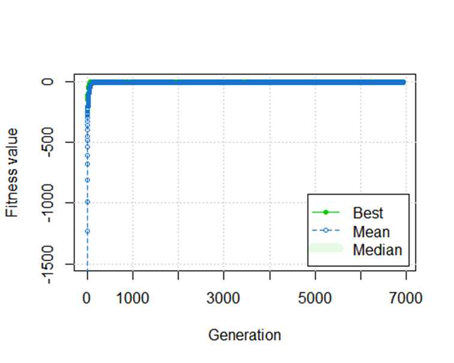
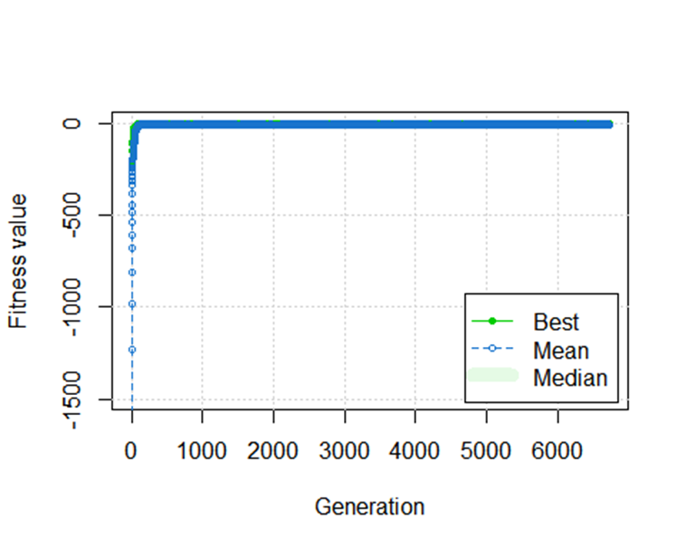

portfolio_optimization
Rahul Nair
2023-02-23
Part 1:
Stocks
I chose set of 10 stocks for the part 1. These assets have no NA data points and covers a range of industries
myStocks <- c("TSLA", "IBM", "INTC","NVDA","GOOGL","COP","XOM","HPQ","SONY","ORCL")
###Getting the data for the year 2019 to train on
getSymbols(myStocks, from="2019-01-01",to="2020-01-01")
###Functions Functions to generate initial population and create the data for the stocks passed to it. I also have a contraints function in place to take of the contraints in this problem since the sum has to be equal to 1, no less and no more than 1. For this I used an the approach where I penalize any sum of the vector of weights which is not equal to one and this penality is used in the fitness function

```bash
genarate_population <- function (pop_size) {
  for(i in 1:pop_size){
    wts <- runif(n=length(myStocks))

    wts <- wts/sum(wts)
    if(i == 1){
      pop_mat <- rbind(wts)
    }
    else{
      pop_mat <- rbind(pop_mat,wts)
    }

  }
  return(pop_mat)
}
constraint = function(x) {
  boundary_constr = (sum(x)-1)**2   # "sum x = 1" constraint

  for (i in 1:length(x)) {
    boundary_constr = boundary_constr + max(c(0,x[i]-1))**2 + max(c(0,-x[i]))**2
  }

  return (boundary_constr)
}
create_data <- function(stocks){
  prices <- lapply(stocks,function(x) {Ad(get(x))})
  names(prices) <- c(stocks)

  # Daily returns
  daily_ret <- lapply(prices,dailyReturn)
  daily_ret <- do.call(merge,daily_ret)
  colnames(daily_ret) <- stocks

  # Annualized returns
  annual_ret <- lapply(prices,yearlyReturn)
  annual_ret <- do.call(merge,annual_ret)
  colnames(annual_ret) <- stocks

  # Covariance matrix
  cov_mat <- cov(daily_ret)

  return(list("prices" = prices,
              "daily_ret" = daily_ret,
              "annual_ret" = annual_ret,
              "cov_mat" =   cov_mat))
}
```

Fitness function
This is the fitness function which tries to maximise the sharpe ratio. The sharpe ratio is the return/risk ratio which is very popular in the Modern Portfolio Theory.To make the performance time saving, I already used the create_data function to keep the data ready if we are to use the same assets. The penality for handling the constraints deducts some value from the final sharpe ratio in order to indicate that the solution is not optimal for the objective

```bash
obj_opt_func <- function(wts,data,fast){
  days = 252
  cov_mat <- data$cov_mat
  #Risk
  daily_risk <- t(wts) %*% cov_mat %*% wts
  yearly_risk <- ((1 + daily_risk)^days)-1
  yearly_risk <- sqrt(yearly_risk)
  #Return
  yearly_return <- sum(data$annual_ret * wts)
  #Sharpe ratio
  sharpe <- yearly_return/yearly_risk
  if (fast) {
    return(sharpe-100*constraint(wts))
    }
  else {
    return(list("return" = yearly_return,
                "risk" = yearly_risk,
                "fitness" = sharpe-100*constraint(wts)))
  }
}
```

Running GA
Then we run the GA and the get the optimal weights.It tries to maximise the fitness function with the objective to find optimal weights that balance the return-risk ratio. I ran it with custom mutation and crossover rate but the default params seemed to work better so I decided to go with default params

```bash
optimal_returns = function(stock){
  data_mat <- create_data(stock)
  ga_res <- ga(
    type="real-valued",
    fitness = function(x){obj_opt_func(x,data_mat,fast=TRUE)},
    lower = rep(0,length(myStocks)),
    upper = rep(1,length(myStocks)),
    maxiter = 7000,
    run=300,
    monitor=TRUE,
    seed=1,
    popSize = 300
  )
  return(ga_res)
}

sol = optimal_returns(myStocks)
## GA | iter = 1 | Mean = -1635.1845 | Best =  -199.0791
## GA | iter = 6927 | Mean = -4.084517 | Best =  1.991294
## ── Genetic Algorithm ───────────────────
##
## GA settings:
## Type                  =  real-valued
## Population size       =  300
## Number of generations =  7000
## Elitism               =  15
## Crossover probability =  0.8
## Mutation probability  =  0.1
## Search domain =
##       x1 x2 x3 x4 x5 x6 x7 x8 x9 x10
## lower  0  0  0  0  0  0  0  0  0   0
## upper  1  1  1  1  1  1  1  1  1   1
##
## GA results:
## Iterations             = 6927
## Fitness function value = 1.991294
## Solution =
##              x1         x2         x3        x4        x5          x6        x7
## [1,] 0.03046793 0.06031688 0.03817435 0.3534312 0.1120104 0.001783177
```



Comparison of different weights
Here I compare the performance of the evolved weights with random weights and equal weights. As it is clearly visible, the evlved weights from the GA solution performs better compared to the other 2

```bash
eq_wts <- c(0.1,0.1,0.1,0.1,0.1,0.1,0.1,0.1,0.1,0.1)
rnd_wts <- runif(10)
rnd_wts <- rnd_wts/sum(rnd_wts)
data_mat <- create_data(myStocks)
eq_data <- obj_opt_func(eq_wts,data_mat,fast=FALSE)
rnd_data <- obj_opt_func(rnd_wts,data_mat,fast=FALSE)
evolved_data <- obj_opt_func(evolved,data_mat,fast=FALSE)
rnd_data

## $return

## [1] 0.2794342

##

## $risk

## [,1]

## [1,] 0.1936256

##

## $fitness

## [,1]

## [1,] 1.443168

eq_data

## $return

## [1] 0.2590871

##

## $risk

## [,1]

## [1,] 0.1850997

##

## $fitness

## [,1]

## [1,] 1.399717

evolved_data

## $return

## [1] 0.4686125

##

## $risk

## [,1]

## [1,] 0.2353298

##

## $fitness

## [,1]

## [1,] 1.991294
```

Future unseen data
Here I compare the performance of evolved, equal and random weights on unseen data i.e. data for the year 2020 and as visible the evolved weights that were obtained by training the GA on 2019 data actually yield a good return-rish ratio, it even gets a better sharpe ratio

```bash
getSymbols(myStocks, from="2020-01-01",to="2021-01-01")
data_mat <- create_data(myStocks)
eq_future_data <- obj_opt_func(eq_wts,data_mat,fast=FALSE)
evolved_future_data <- obj_opt_func(evolved,data_mat,fast=FALSE)
rnd_future_data <- obj_opt_func(rnd_wts,data_mat,fast=FALSE)
eq_future_data

## $return

## [1] 0.8652906

##

## $risk

## [,1]

## [1,] 0.4190404

##

## $fitness

## [,1]

## [1,] 2.064934

evolved_future_data

## $return

## [1] 0.8233899

##

## $risk

## [,1]

## [1,] 0.4070424

##

## $fitness

## [,1]

## [1,] 2.022853

rnd_future_data

## $return

## [1] 1.225511

##

## $risk

## [,1]

## [1,] 0.4069259

##

## $fitness

## [,1]

## [1,] 3.011632
```

Maximising risk in the portfolio
Here I have modified the fitness function to maximise the risk, just to try and see what returns we end up with using the new weights.

```bash
getSymbols(myStocks, from="2019-01-01",to="2020-01-01")
obj_max_risk_func <- function(wts,data,fast){
days = 252
#Risk
daily_risk <- t(wts) %_% data$cov_mat %_% wts
yearly_risk <- ((1 + daily_risk)^days)-1
yearly_risk <- sqrt(yearly_risk)
#Return
yearly_return <- sum(data$annual_ret * wts)
#fitness value
fitness <- (yearly_risk-100*constraint(wts))
if (fast) {
return(fitness)
}
else {
return(list("return" = yearly_return,
"risk" = yearly_risk,
"fitness" = fitness))
}
}
```

Running GA for the max risk
In this part we run the GA with the modified fitness function to maximise the risk, in turn expecting higher results. Here the GA will maximise the risk and it still has the penality approach in place to handle the constraints. This penalty approach was inspired by the knapsack problem where we penalise the itmes that doesn’t satisfy the capacity.

```bash
max_risk_ga = function(stock){
data_mat <- create_data(stock)
ga_risk_res <- ga(
type="real-valued",
fitness = function(x){obj_max_risk_func(x,data_mat,fast=TRUE)},
lower = rep(0,length(myStocks)),
upper = rep(1,length(myStocks)),
 maxiter = 7000,
run=300,
monitor=TRUE,
seed=1,
popSize = 300
)

return(ga_risk_res)
}
```

Max risk portfolio performance
Here I have looked at the returns, risk and the fitness score for the solution vector of weights obtained from the max risk GA above. It clearly shows high returns at the cost of high risk when compared the balanced portfolio weights

```bash
risk_sol = max_risk_ga(myStocks)

## GA | iter = 1 | Mean = -1635.0596 | Best = -199.6518

## GA | iter = 2 | Mean = -1233.2858 | Best = -199.6518

## GA | iter = 6730 | Mean = -5.790936 | Best = 0.326436

## ── Genetic Algorithm ───────────────────

##

## GA settings:

## Type = real-valued

## Population size = 300

## Number of generations = 7000

## Elitism = 15

## Crossover probability = 0.8

## Mutation probability = 0.1

## Search domain =

## x1 x2 x3 x4 x5 x6 x7 x8 x9 x10

## lower 0 0 0 0 0 0 0 0 0 0

## upper 1 1 1 1 1 1 1 1 1 1

##

## GA results:

## Iterations = 6730

## Fitness function value = 0.326436

## Solution =

## x1 x2 x3 x4 x5 x6 x7

## [1,] 0.4951327 0.01861155 0.06747614 0.2483854 0.04244809 0.02710011

risk_evolved <- c(summary(risk_sol)$solution)
data_mat <- create_data(myStocks)
risk_evolved_perf <- obj_max_risk_func(risk_evolved,data_mat,fast=FALSE)
risk_evolved_perf

## $return

## [1] 0.4100319

##

## $risk

## [,1]

## [1,] 0.3265829

##

## $fitness

## [,1]

## [1,] 0.326436

plot(risk_sol)
```



Comparison of the performance of high risk portfolio with different weights
Here I have compared the returns, risk and the fitness of the evolved weights from the max risk portfolio with random and even weights. The GA solution again has the better results when compared to the other 2

```bash
data_mat <- create_data(myStocks)
risk_evolved_perf <- obj_max_risk_func(risk_evolved,data_mat,fast=FALSE)
risk_eq_data <- obj_opt_func(eq_wts,data_mat,fast=FALSE)
risk_rnd_data <- obj_opt_func(rnd_wts,data_mat,fast=FALSE)
risk_evolved_perf

## $return

## [1] 0.4100319

##

## $risk

## [,1]

## [1,] 0.3265829

##

## $fitness

## [,1]

## [1,] 0.326436

risk_eq_data

## $return

## [1] 0.2590871

##

## $risk

## [,1]

## [1,] 0.1850996

##

## $fitness

## [,1]

## [1,] 1.399717

risk_rnd_data

## $return

## [1] 0.2794342

##

## $risk

## [,1]

## [1,] 0.1936255

##

## $fitness

## [,1]

## [1,] 1.443168
```

Part 2
GA for top 10 assets from a pool of 50
For this I have selected a list of 50 assets with none of them having NA data points. These assets cover various industries and are part of the NASDAQ 100.

```bash
stock_pool <- sort(c("AAPL","MSFT","GOOG","GOOGL","AMZN","TSLA","NVDA","META","ASML","AVGO","PEP",
"COST","AZN","XOM","TMUS","ADBE","NFLX","CMCSA","TXN","QCOM","AMD","HON","AMGN",
"SBUX","PDD","INTU","INTC","GILD","AMAT","ADP","BKNG","ADI","PYPL","MDLZ","HPQ",
"REGN","IBM","VRTX","FISV","LRCX","MU","CSX","SONY","CHTR","ORCL","COP",
"KLAC","SNPS","MAR","MNST"))

getSymbols(stock_pool, from="2019-01-01",to="2020-01-01")
```

Functions get_stocks function retrieves a list of 10 the stocks from the pool of 50 assets
In this approach I have used the binary representation with 50 bits. ! representing the selected assets from the sorted list of 50 stocks above.

```bash
get_stocks <- function(bit_vector, big_list)
{
selected <- c()
for (i in 1:length(bit_vector))
{
if (bit_vector[i]==1) {

      selected <- append(selected,big_list[i])
      }

}
return (selected)
}
```

Function below is used to generate initial population for the GA to search for 10 optimal assets from the 50.

```bash
random_50bits <- function(x) {
for (r in 1:100) {
random_assets <-sample(1:50,10)
empty_port <- rep(0,50) #empty vector with just ones
chosen<- replace(empty_port,random_assets,1)#replace 10 positions randomly with 1
if (r == 1) {
initialPop <- rbind(chosen)
}
else
{
initialPop <- rbind(initialPop,chosen) #append each row to the matrix
}
}
return(initialPop) #return matrix of population to the GA function
}
```

Fitness function
This is the fitness function to choose 10 assets from the 50 assets pool. In this function, just like in the first part, it uses an approach to check how the random solution of 10 chosen assets performs in terms of yearly returns. The assets with high yearly returns will increase the score. There is a penalty present if the solution vector doesn’t add up to 10. This penalty is deducted from the returns of the profile to indicate the solution not being good for the objective.

```bash
bit_port_obj <- function(bit_vector, big_list, in_GA)
{
std_vector <- c(1,1,1,1,1,1,1,1,1,1)
#std_vector <- std_vector/sum(std_vector)
penalty <- (2 _ (sum(bit_vector)-10)^2)
#Get data for the selected stocks
 stock_list <- get_stocks(bit_vector, big_list)
#print(stock_list)
data_mat <- create_data(stock_list)
daily_ret <- data_mat$daily_ret
  yearly_ret <- data_mat$yearly_ret
cov_mat <- data_mat$cov_ma
#Return
yearly_return <- sum(std_vector _ yearly_ret)
#Performance adjusted by penalty if incorrect number of assets in the portfolio
final_fitness <- yearly_ret - penalty
if (in_GA) {
return(final_fitness)
}
else {
return(list(
"yearly_return" = yearly_ret,

                "fitness" = final_fitness))

}
}
```

GA for asset selection
Here we run the GA with the fitness function implmented above to find a portfolio with 10 best performing stocks from a list of 50. The GA takes a long time to look for a solution since the computation of all the data takes longer when it comes to retrieving the returns and risk data form a pool of 50 assets

```bash
bit_portfolio_GA <- function(big_list, in_GA=TRUE) {
GA_sol <- ga(type="binary",
nBits = 50,
maxiter = 7000,
fitness = function(x) {bit_port_obj(x, big_list, in_GA)},
popSize = 100,
population = random_50bits
)

return(GA_sol)
}
```
